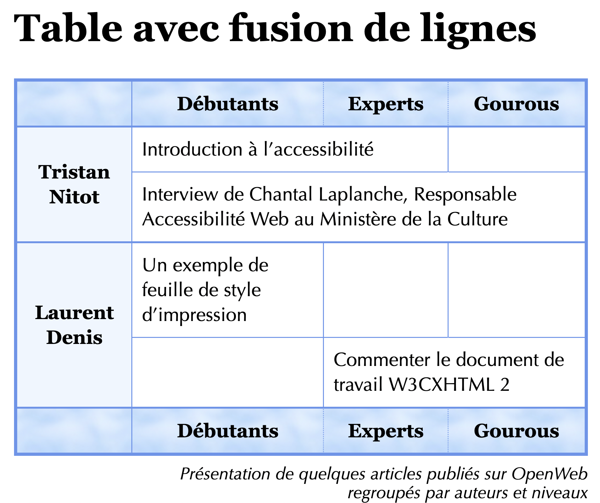

# html-table-openweb

> HTML exercise about tables

* * *

**html-table-openweb** is an educational project, which will be used for HTML courses.

**Note:** the school where the course is given, the [HEPL](http://www.provincedeliege.be/hauteecole) from Liège,
Belgium, is a french-speaking school. From this point, the instruction will be in french. Sorry.

* * *

## Exercice sur les tableaux

Créez le fichier `index.html` avec les bonnes balises afin d’arriver au résultat suivant :



L’objectif de cet exercice est de réaliser une table avec des fusions de lignes et de colonnes. Il est tiré d’un
tutoriel d’Openweb que vous trouverez ci-dessous dans la rubrique ressources et que vous pouvez suivre pour vous aider à
réaliser l’exercice si vous éprouvez des difficultés.

### Aides

1. Commencez par baliser la table comme s’il n’y avait pas de fusions ;
2. Utilisez les balises pour structurer votre tableau (en-tête, corps et pied de tableau) ;
3. Ajoutez les attributs nécessaires pour fusionner les colonnes ;
4. Ajoutez les attributs nécessaires pour fusionner les lignes ;
5. Ajoutez les attributs d’accessibilité pour lier les cellules de données et les cellules de titre (vous devez ici,
   obligatoirement, travailler avec les attributs `id`/`headers` car il y a une fusion de lignes et de colonnes dans le
   tableau) ;
6. N’oubliez pas les entités pour les caractères spéciaux ;
7. N’oubliez pas non plus de valider régulièrement votre code ;
8. Liez la feuille de styles et ajouter les attributs *éventuellement* nécessaires pour obtenir le rendu final.

### Rappel

Pour autant que l’extension *Emmet* soit installée dans votre éditeur de texte, vous pouvez utiliser, comme vu aux
séances de TPs, des raccourcis pour générer plus rapidement des patterns de lignes qui se répètent.

Voici, pour rappel, les symboles utiles et leur signification :

- `>` : enfant direct (quand on souhaite imbriquer une balise à l’intérieur d’une autre) ;
- `+` : frère adjacent (quand on souhaite imbriquer une balise à la suite d’une autre à l’intérieur du même parent) ;
- `[]` : pour ajouter un attribut dans une balise ;
- `*` : pour répéter un pattern ;
- `()` : pour regrouper des patterns qui doivent se répéter.

Exemple :

`(tr>th[id=""]+(td[headers=""]*3))*8` + `TAB`

va générer 8 lignes (8 balises `tr`) qui contiennent toutes un `th`avec un attribut `id`et 3 `td` avec chacun un attribut `headers` comme ceci :

```html 
<tr>
	<th id=""></th>
	<td headers=""></td>
	<td headers=""></td>
	<td headers=""></td>
</tr>
<tr>
	<th id=""></th>
	<td headers=""></td>
	<td headers=""></td>
	<td headers=""></td>
</tr>
<tr>
	<th id=""></th>
	<td headers=""></td>
	<td headers=""></td>
	<td headers=""></td>
</tr>
<tr>
	<th id=""></th>
	<td headers=""></td>
	<td headers=""></td>
	<td headers=""></td>
</tr>
<tr>
	<th id=""></th>
	<td headers=""></td>
	<td headers=""></td>
	<td headers=""></td>
</tr>
<tr>
	<th id=""></th>
	<td headers=""></td>
	<td headers=""></td>
	<td headers=""></td>
</tr>
<tr>
	<th id=""></th>
	<td headers=""></td>
	<td headers=""></td>
	<td headers=""></td>
</tr>
<tr>
	<th id=""></th>
	<td headers=""></td>
	<td headers=""></td>
	<td headers=""></td>
</tr>
```

### Ressource

Tutoriel d’Openweb sur les tableaux : http://openweb.eu.org/articles/tableaux_css/git 